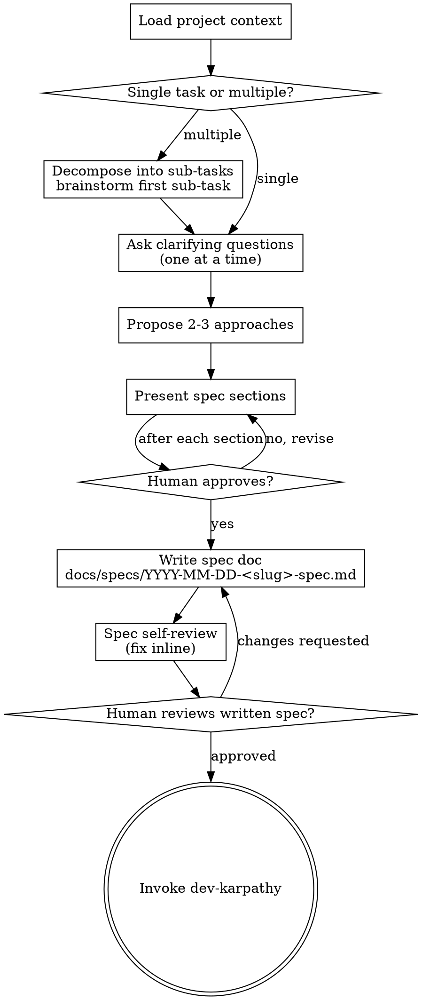

# Developer Pre-Implementation Brainstorm

> **Adapted from `superpowers:brainstorming`** — the original skill is the authoritative
> source for the full collaborative design process. This adaptation narrows scope to
> code-specific decisions a Developer agent must make before executing an implementation loop.

Turn a task description into a concrete, approved spec before writing a single line of code.

<HARD-GATE>
Do NOT write code, create files, scaffold components, or enter any implementation loop
until you have presented a spec and the human has explicitly approved it.
This applies to every task — bug fixes included.
</HARD-GATE>

## Why This Matters

"Simple" tasks are where unexamined assumptions waste the most work. A two-sentence spec
for a one-function change is fine — the discipline is what matters, not the length.

---

## Checklist

Create a task for each item. Complete them in order.

1. **Load project context** — read `docs/project-status.html`, recent commits, affected files
2. **Confirm scope** — is this one task or multiple independent sub-tasks? Decompose if needed
3. **Ask clarifying questions** — one at a time (see rules below)
4. **Propose 2–3 approaches** — with trade-offs and your recommendation
5. **Present spec** — section by section, get the human's confirmation after each
6. **Write spec doc** — save to `docs/specs/YYYY-MM-DD-<slug>-spec.md` and commit
7. **Spec self-review** — scan for placeholders, contradictions, ambiguity (fix inline)
8. **Human review gate** — ask the human to read the written spec before proceeding
9. **Enter implementation loop** — invoke `dev-karpathy` skill

---

## Process Flow

**The terminal state is invoking `dev-karpathy`.** Do not start coding before reaching it.

---

## Step-by-Step Guide

### Step 1 — Load Project Context

Before asking anything, read:

- `docs/project-status.html` — current sprint, in-progress items, blockers
- Recent git commits (`git log --oneline -10`) — what changed recently
- The files most likely to be affected by this task

This prevents proposing changes that duplicate in-progress work or conflict with recent edits.

### Step 2 — Confirm Scope

If the task description covers multiple independent subsystems, flag it immediately:

> "This touches [X] and [Y] which are independent. Should we spec and implement them
> separately, or do they share enough state to treat as one?"

Only proceed to questions once scope is agreed. Each independent piece gets its own
brainstorm → spec → implementation cycle.

### Step 3 — Ask Clarifying Questions

*(Adapted from `superpowers:brainstorming` §"Understanding the idea")*

- **One question per message.** Never stack questions.
- **Prefer multiple-choice** over open-ended when options are enumerable.
- Focus on: purpose, constraints, success criteria, edge cases.
- Stop asking when you can write the spec without guessing.

### Step 4 — Propose 2–3 Approaches

*(Adapted from `superpowers:brainstorming` §"Exploring approaches")*

Lead with your recommendation and explain why. Show trade-offs concisely:

| Approach | Pro | Con | Rec? |
|----------|-----|-----|------|
| A | … | … | ✅ |
| B | … | … | |
| C | … | … | |

### Step 5 — Present Spec Sections

*(Adapted from `superpowers:brainstorming` §"Presenting the design")*

Cover these sections, scaled to complexity (a few sentences if simple):

1. **What we're building** — one-paragraph summary
2. **Files to create / modify** — explicit paths following the IL folder structure
3. **Data flow** — how data moves through the change
4. **Error handling** — what fails, how it's surfaced
5. **Testing** — what to verify before handing off to QA

Ask "Does this look right so far?" after each section. Revise before moving on.

**Design for isolation** *(from `superpowers:brainstorming` §"Design for isolation and clarity")*:

- Each unit has one clear purpose, well-defined interface, testable in isolation.
- If a file is growing large, that's a signal it's doing too much — split it.
- Follow existing patterns before introducing new ones.

### Step 6 — Write the Spec Doc

Save to: `docs/specs/YYYY-MM-DD-<slug>-spec.md`

Include:
- Task summary
- Chosen approach and rationale
- Files to create / modify (with paths)
- Acceptance criteria (concrete, testable)
- Out of scope (what this deliberately does NOT do)

Commit the file to git before asking for human review.

### Step 7 — Spec Self-Review

*(Adapted from `superpowers:brainstorming` §"Spec Self-Review")*

Look at the written spec with fresh eyes:

1. **Placeholder scan** — any TBD, TODO, or vague requirements? Fix them.
2. **Consistency** — do file paths, data flow, and acceptance criteria agree?
3. **Scope check** — is this one implementation plan, or does it need to be split?
4. **Ambiguity** — any requirement that could be read two ways? Pick one, make it explicit.

Fix inline. No need to re-review after fixes.

### Step 8 — Human Review Gate

> "Spec written and committed to `docs/specs/<filename>`. Please review it and let me
> know if you want any changes before I start implementing."

Wait for explicit approval. If changes are requested, update the spec and re-run Step 7.

### Step 9 — Enter Implementation Loop

Invoke the `dev-karpathy` skill. This is the only next step.

---

## Key Rules

| Rule | Detail |
|------|--------|
| One question at a time | Stacking questions slows answers and loses context |
| YAGNI | Cut every feature not required by the task |
| Cite patterns | When adopting a pattern, name the source (see developer agent best practices) |
| No implementation before approval | The HARD-GATE above is absolute |
| Follow IL folder structure | Read `templates/project-scaffold/FOLDER-STRUCTURE.md` if unsure where a file goes |

---

## Credits

Adapted from [`superpowers:brainstorming`](https://github.com/anthropics/claude-code) —
`claude-plugins-official/superpowers v5.1.0`, skill file: `skills/brainstorming/SKILL.md`

Original authors: Anthropic / Claude Code superpowers plugin team.

**What changed in this adaptation:**

| Original | This adaptation |
|----------|----------------|
| General-purpose design brainstorm | Scoped to Developer agent pre-implementation gate |
| Visual companion (browser mockups) | Removed — code tasks don't need UI mockups |
| Terminal state: `writing-plans` skill | Terminal state: `dev-karpathy` skill |
| Spec saved to `docs/superpowers/specs/` | Spec saved to `docs/specs/` (IL convention) |
| Any collaborator triggers it | Only the Developer agent triggers it, before every implementation loop |
