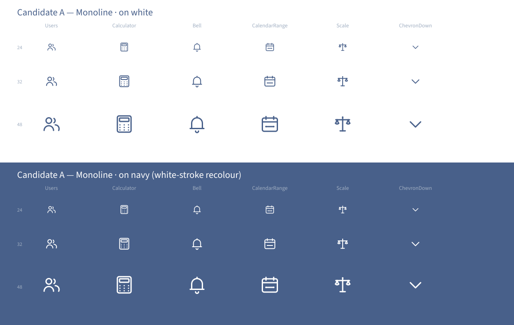

# Candidate A — Pure Monoline

> **Direction axis:** strictest interpretation of `docs/brand/icon-direction.md` §2 + §3. Lucide-shaped restraint applied with the LSL palette.
> **Author:** designer agent.
> **Date:** 2026-06-05.

This candidate is the **conservative pick**. Every icon is a single line-art glyph at 1.5px navy stroke on a 24×24 viewBox, with round caps and round joins. No fills, no broken-line details, no gold accents in the default state. It is the closest 1-to-1 visual replacement for the current Lucide-react surface — if the operator wants the swap to be effectively invisible to a returning user, this is the candidate.

## Visual rationale

The wordmark direction document is unambiguous about restraint. §3 of `icon-direction.md` says:

> Gold is a signal, not decoration. If everything is gold, nothing is.

Candidate A takes that line at its strictest. Every gold-accent variant from §5 of the direction doc (the "today" marker on `CalendarRange`, the gold tick on `CheckCircle2`, the gold dot on `Filter`) is a **separate variant component**, not the default. The default Pay-history sidebar icon is just a navy calendar — no warm focal point competing with the page content beside it. The active/important variants are produced as a second pass during the production round.

This matches how Lucide itself works (a mark + an explicit state), so the production set is conceptually cheap to deliver — for every icon we ship a base SVG + an optional accent SVG, not a third state.

## Palette use

- **Navy `#48608a`** — every glyph stroke. ~100% of the surface, by design.
- **Pale grey-blue `#a0aec1`** — reserved for disabled-state recolour (consumer applies via Tailwind), not used in default exports.
- **Gold `#d9a428`** — never appears in the default base set. Active/important variants will add a single gold mark per icon when the production round runs.
- **White `#ffffff`** — only when the consumer paints the icon with `text-white` for use on a navy field (the bottom half of the preview shows this — exact same SVG, recoloured via `currentColor`).

## Encircled vs standalone

Standalone is the *only* default treatment in Candidate A. The encircled variant (per direction §4.2) is produced as a separate set of components during the production round — `<Users>` ships flat; `<UsersEncircled>` ships as the section-header-tier variant. This keeps the icon barrel surface clean and matches the existing Lucide ergonomics (no consumer changes the import shape; encircled is a wrapper or a sibling component).

## Scale fidelity

| Display size | Behaviour |
| --- | --- |
| 16×16 | Sub-favicon scale. Tight, but the geometry holds. The CalendarRange range-bar dots merge into the bar at 16px — that is acceptable for an icon used only at small sizes alongside text. |
| 24×24 | Default body scale. Reads identically to Lucide. |
| 32×32 | Sidebar nav scale. The 1.5px stroke holds — no thinning required per direction §2. |
| 48×48 | Page-header anchor scale. Per direction §2 stroke weight stays at 1.5px (does not thicken). |
| 64×96 | Encircled section-header tier. Stroke steps up to 2px per direction §2. |

## Trade-offs

| Pro | Con |
| --- | --- |
| Cheapest production round — the base set is the canonical Lucide replacement. | Lowest visual distinctiveness. A returning user may not notice the swap happened. |
| Easiest path to the OQ-2 deadline (E5.6). | Hardest case to make to operator stakeholders that the icon set *is* a deliberate brand asset. |
| Lowest accessibility risk — pure monoline at 1.5px clears WCAG iconography contrast at any scale on white. | Misses an opportunity to use the direction doc's §5.1 broken-line permission. |
| Smallest payload (no per-icon secondary structure). | Default-state icons feel "library", not "bespoke". |

## When to pick this

Pick Candidate A if:
- The operator's instinct is "the icons should be invisible — the content does the talking".
- Stakeholders include people who would describe a notification dot as "fussy".
- The production deadline is tight and the operator wants the smallest risk surface.
- The brand identity is already carrying its weight via the wordmark + Phase 2 design tokens + Source Sans / Montserrat typography.

## When to reject this

Reject Candidate A if:
- The operator wants the icon set to be a *visible* differentiator from "every other Tailwind app".
- The direction doc's "subtle broken-line details" permission feels load-bearing for the brand voice.
- The encircled/stamp tier needs to be the default for navigation surfaces, not a variant.
