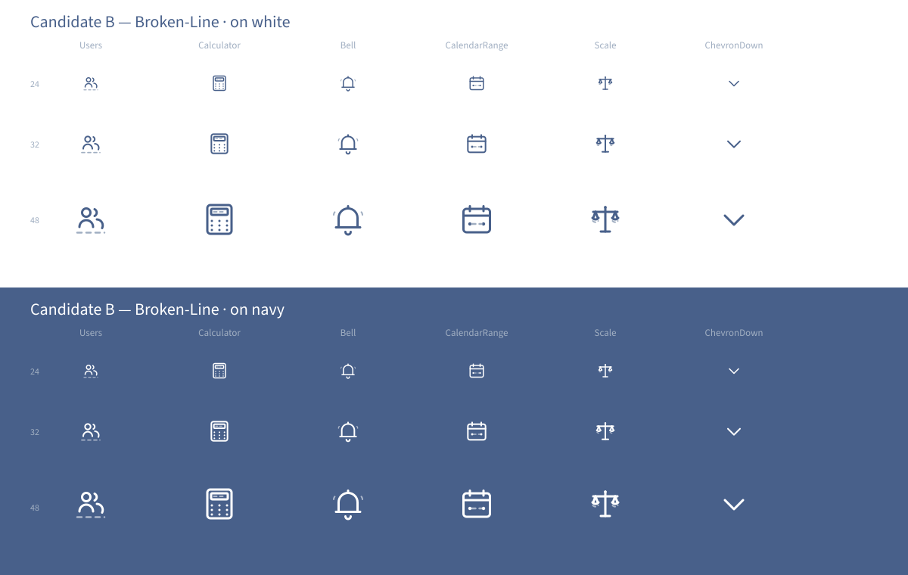

# Candidate B — Broken-Line Detail

> **Direction axis:** leans on the `docs/brand/icon-direction.md` §2 / §5.1 explicit permission for *"subtle broken-line details for secondary structural lines"*. Restrained tactile depth on a monoline base.
> **Author:** designer agent.
> **Date:** 2026-06-05.

This candidate is the **brand-voice pick**. The primary glyph is the same 1.5px navy monoline as Candidate A — but each icon also carries a single piece of dashed grey-blue secondary structure that makes the mark feel **deliberate and earned**, not just a re-tinted Lucide.

## Visual rationale

`docs/brand/icon-direction.md` §2 permits — even encourages — `stroke-dasharray="3 3"` for secondary structural lines. The direction was written explicitly to enable this candidate. The spec §5.1 requirement reads:

> Light line-weight, *optionally with subtle broken-line details*, standalone or encircled.

Candidate A treats the "optionally" as "optional but not exercised". Candidate B treats it as "this is what makes our icon family our icon family". Each icon's dashed mark adds **semantic richness** without breaking the monoline restraint:

- **Users** carries a dashed roster row underneath the two figures — hints at "list of employees" without redrawing the empty-state illustration into the icon.
- **Calculator** carries a dashed display tape inside the screen — references printed receipts (the literal payroll-compliance artefact this product produces) without becoming literal.
- **Bell** carries dashed "ringing wave" arcs flanking the bell — adds notification semantic without the consumer-app cliché of solid sound waves.
- **CalendarRange** carries a dashed connector between the two endpoint dots — this is the cleanest visual reading of "range" of any of the three candidates.
- **Scale** carries dashed pan shadows — adds physical depth (the pans "float" above their shadows) and reinforces the weighing semantic for the Liability surface.
- **ChevronDown** does **not** carry a dashed accent — it's too small and too purely-directional. Documented exception: broken-line where it adds meaning, plain monoline where it doesn't.

## Palette use

- **Navy `#48608a`** — primary glyph stroke. 1.5px. Identical to Candidate A.
- **Pale grey-blue `#a0aec1`** — secondary dashed structure. 1px or 1.25px stroke depending on the icon, with `stroke-dasharray="3 3"` (or `2 2` for tighter rhythm at small marks). Per direction §3 *"pale grey-blue for tertiary structural elements — pushes them back visually"*.
- **Gold `#d9a428`** — never in the default state; reserved for the active/important variant set in the production round (same convention as Candidate A).
- **White `#ffffff`** — on-navy recolour. The dashed secondary becomes white at 55% opacity on the navy field (see bottom half of preview) so it stays subordinate to the primary glyph.

## Encircled vs standalone

Same as Candidate A: standalone is the default; the encircled variant is a separate production deliverable. Per direction §4.2 the encircled treatment is for section-header / nav-anchor / status surfaces — a different consumer surface from inline body icons.

## Scale fidelity

| Display size | Behaviour |
| --- | --- |
| 16×16 | The dashed secondary disappears (becomes a continuous faint mark or vanishes into the pixel grid). That is the **correct** behaviour — at favicon scale the primary glyph is the brand signal, the secondary noise is not. The icon degrades gracefully to a Candidate-A appearance. |
| 24×24 | Both primary and secondary read. The dashed elements are visible but subordinate — exactly the §3 grey-blue "push them back" intent. |
| 32×32 | Both primary and secondary read clearly. Sweet spot. |
| 48×48 | Both primary and secondary read. The dashed elements add visible richness. |
| 64×96 | Encircled treatment. Primary stroke steps up to 2px (per direction §2); the secondary stays 1px so the visual hierarchy holds. |

## Trade-offs

| Pro | Con |
| --- | --- |
| Strongest brand voice of the three. Each icon reads as deliberate. | Slightly more expensive production round — each icon needs the secondary path drawn, not just the primary. |
| Honours the direction doc's most distinctive permission (§2 + §5.1 broken-line). | Some icons have no natural place for a broken-line accent (ChevronDown, X, Plus). The candidate has to gracefully degrade to monoline for those — a documented exception, not a failure, but a thing to explain. |
| Empty-state illustrations (per direction §10) carry the same broken-line grammar — the icons and illustrations form **one** visual family, not two. | At 16×16 the secondary disappears. The icon's brand voice partly relies on a feature that doesn't survive favicon scale. |
| Pairs cleanly with the wordmark's restraint-first posture without competing. | A returning user who knows Lucide-by-eye will notice the swap — usually a good thing, occasionally a stakeholder distraction. |

## When to pick this

Pick Candidate B if:
- The operator wants the icon set to be a recognisable brand asset, not a re-tinted library.
- The direction doc's §10 empty-state illustration grammar (broken-line secondary structure) is going to ship — Candidate B makes the icons and the illustrations look like the same family.
- Stakeholders include design-eye people who would call out "the icons look basic" if A were chosen.

## When to reject this

Reject Candidate B if:
- The operator finds the dashed accents fussy or "decorated" — even though they're spec-compliant.
- The production budget is tight and per-icon secondary structure adds too much per-icon time.
- The brand voice has shifted toward "stamp" (Candidate C) and the broken-line vocabulary feels out of step.
