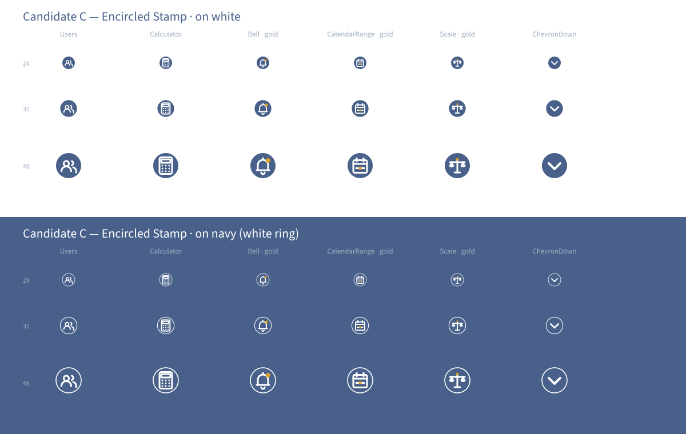

# Candidate C — Encircled Stamp

> **Direction axis:** elevates the `docs/brand/icon-direction.md` §4.2 *"encircled"* container treatment from a variant to the **default**. Stamp-first identity with restrained gold accents per §3 semantics.
> **Author:** designer agent.
> **Date:** 2026-06-05.

This candidate is the **brand-system pick**. Every icon ships as a filled navy disc with a white-stroke glyph inside it — a recurring stamp that reads instantly as "an LSL Calculator icon" before the eye even resolves which semantic the glyph carries. Selective gold accents earn the user's eye on the icons that semantically deserve them (per direction §3 "important" semantic rule).

## Visual rationale

The direction doc devotes §4.2 to the encircled treatment but treats it as a *variant* — used "when the icon is the anchor of a section header, a top-level nav item, or a status block". Candidate C takes the position that for **a payroll-compliance product producing formal PDF reports**, the icons *are* anchors. The sidebar entries are nav anchors. The empty-state illustrations are status anchors. The PDF cover badge is a brand anchor. The TopNav bell is a notification anchor. Treating "anchor" as the default and "inline" as the variant flips the convention — and matches the tonal posture in §1 of the direction:

> The LSL Calculator icon system feels quiet, geometric, and professionally restrained — a navy line-art family that ladders directly up from Candidate B's stacked masthead wordmark.

A masthead implies a stamp. Candidate C is the stamp.

The gold accents are applied per direction §3 semantics:

- **Users** — no gold default. Gold dot reserved for the "active tenant" / "selected employee" variant.
- **Calculator** — no gold ever. Per direction §5 *"no 'active' state for a brand affordance"* — restraint upheld.
- **Bell** — gold dot at the unread-notification position. Per §3 *"important / active state earns gold"*. Notifications are the canonical "important" semantic.
- **CalendarRange** — gold "today" filled square. Per direction §5 row *"small gold filled square as the 'today' marker"* — verbatim the spec example.
- **Scale** — gold dot at the hook anchor. Pairs with the "anchor" semantic across the family (gold = "anchored value").
- **ChevronDown** — no gold. Purely directional, no semantic to anchor.

## Palette use

- **Navy `#48608a`** — disc fill on every icon. ~70% of the icon's visual mass.
- **White `#ffffff`** — every glyph stroke at 1.5px (2px for the ChevronDown to read inside the disc). The white provides high WCAG contrast against the navy fill (~7:1 — clears WCAG 2.1 AA *and* AAA for large text/non-text).
- **Gold `#d9a428`** — earned accent per §3 restraint rule. Used on **at most one element per icon**, on **only ~3 of every 10 icons** in the production set.
- **Pale grey-blue `#a0aec1`** — not used in the default Candidate C variants. Reserved for disabled-state recolour (consumer flips the disc fill to grey-blue via Tailwind).

## Encircled vs standalone

Encircled **is** the default. A standalone (un-discced) variant ships as `<UsersStandalone>` for the rare inline body-text usage where a disc would feel heavy (e.g. mid-paragraph icon callouts). For the production set this means **two SVGs per semantic** — disced + standalone — but the consumer surface stays simple because the named import is the disced default.

This is a real cost: ~35 base + ~35 standalone = ~70 SVGs vs ~35 in Candidates A/B. The trade-off is bought by the brand identity: Candidate C is the only candidate where you can see one icon at thumbnail scale and recognise the *family* immediately.

## Scale fidelity

| Display size | Behaviour |
| --- | --- |
| 16×16 | The disc + glyph still read as a stamp, but the inner detail collapses. Acceptable — at favicon scale the system uses the dedicated favicon set per direction §7 anyway (navy rounded square + gold corner). The icon at 16×16 is a fallback, not a primary surface. |
| 24×24 | Stamp identity reads clearly. Glyph detail intact. Gold accents visible as warm spots even when their semantic isn't fully resolved. |
| 32×32 | Sweet spot. Disc + glyph + gold accent all sit in clear visual hierarchy. |
| 48×48 | Strong. The encircled treatment is what the direction doc was written for at this scale — anchor-tier presentation. |
| 64–96 | Native section-header-anchor scale (per direction §4.2 — *"64px for nav, 80px for section header, 120px for empty-state anchor"*). This candidate is **born** for this tier. |
| 180+ | The disc + glyph composition can stand in as a brand surface (e.g. PDF cover badge, OG card). Pairs with the existing app-icon (rounded-square navy + gold corner) as a complementary stamp grammar. |

## Trade-offs

| Pro | Con |
| --- | --- |
| Strongest visual identity of the three. A single icon at 24px reads as "LSL Calculator family". | Most expensive production round (~2× the SVGs because every icon needs a standalone variant for inline body use). |
| Best fit for the direction doc's tonal posture (*"masthead", "formal report cover", "anchor"*). | Largest tonal shift from the current Lucide-react surface. Returning users will definitely notice the swap — a feature for brand stakeholders, a friction point for power users mid-flow. |
| Pairs natively with the wordmark's gold accent rule (the gold accents on Bell / Calendar / Scale visually echo the wordmark's gold rule). | The encircled treatment dominates UI density at high-icon-count surfaces (e.g. a table with 5 icon columns — the navy discs stack visually and reduce content legibility). May need a "standalone only" rule for table-cell icons. |
| Strongest favicon-tier brand asset — even at 16×16 the stamp reads as a stamp, just less detailed. | Direction §3 *"restraint"* warning is hardest to honour with this candidate — every icon has a literal warm spot pulling the eye. The discipline of "gold on at-most-3-of-10 icons" must be enforced. |
| Empty-state anchor icons (per direction §4.2 + §10) are simply this candidate's icons at 120px — zero extra work. | The discs against a navy hero / PDF cover background need the white outer ring (shown in the preview's bottom half) to stay readable. Adds a per-context variant. |

## When to pick this

Pick Candidate C if:
- The operator wants the icon set to be a load-bearing brand asset, not just a UI utility.
- The product roadmap includes more brand surfaces (PDF templates, OG cards, marketing site landing-page hero icons) where the stamp grammar pays back.
- Stakeholders include APA brand reviewers who want the calculator to read as a *product*, not a *feature*.
- The production budget can absorb the ~2× SVG count.

## When to reject this

Reject Candidate C if:
- The operator finds the discs visually heavy at the icon-dense surfaces (bulk-results table, multi-column data grids).
- The "restraint" warning in direction §3 feels at risk — too much gold across the surface.
- The production budget is tight and the deadline (E5.6) is the binding constraint.

## Design caveat — ChevronDown stress test

ChevronDown is the candidate's stress test. A 24×24 navy disc containing a small white chevron is **visually heavier** than the surrounding monoline UI — it competes with the parent control (a select trigger, an accordion header) instead of subordinating to it. The preview shows the encircled chevron because that's the candidate's default rule, but the production round will likely carve out an exception: purely-directional micro-icons (ChevronDown, ChevronRight, ArrowRight, X) ship as standalone-only, even in Candidate C. The exception is documented and small — the rest of the surface keeps its stamp identity.
