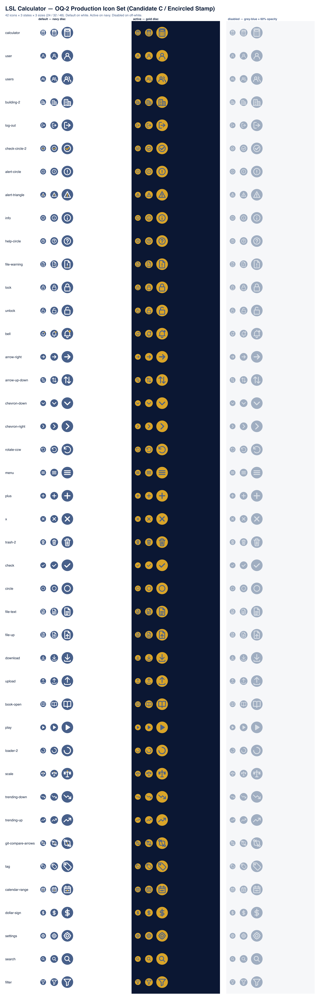

# LSL Calculator — Production Icon Set (OQ-2 / Candidate C — Encircled Stamp)

> **Status:** production assets — the artwork referenced by the `Icon.tsx` barrel swap (the load-bearing follow-up PR).
> **Direction:** [Candidate C — Encircled Stamp](../icon-candidates/candidate-c-encircled-stamp/README.md), selected by the operator on **2026-06-05** in PR #149's 3-candidate concept round. Decision is recorded in [`../icon-candidates/README.md`](../icon-candidates/README.md) DECISION header.
> **Brand source of truth:** [`../icon-direction.md`](../icon-direction.md). Where this README and the direction doc disagree, the direction doc wins.



## What's in this folder

```
docs/brand/icons/
├── README.md                  (this file)
├── production-inventory.md    (per-icon semantic + surface map for all 42 icons)
├── preview-grid.svg / .png    (full set × 3 states × 3 sizes, family-consistency view)
├── scale-check.svg / .png     (sample × 4 sizes on white + navy, scale-fidelity stress test)
├── default/                   (canonical state — navy disc + white glyph, ~42 SVGs)
├── active/                    (selected / pressed — gold disc + navy glyph)
└── disabled/                  (muted — grey-blue disc + white glyph at 60% opacity)
```

## Visual spec — one paragraph

Every icon is a 24×24 SVG containing a filled disc (radius 11, centred) and a glyph drawn inside it. The disc is the brand-stamp container — present on every icon in the family. The glyph follows Lucide-style geometry but is recoloured per the candidate's rules: white stroke 1.5px, round caps/joins, no `<defs>`, no `<g transform>`, no gradients. Three icons (Bell, CalendarRange, Scale) plus a handful more (CheckCircle2, AlertTriangle, FileWarning, GitCompareArrows) earn a single gold accent on the default variant — every other icon stays pure navy + white. Active variants flip the disc to gold and the glyph to navy. Disabled variants drop the disc to pale grey-blue and apply 60% opacity to the glyph.

## Colour tokens

| Role | Hex | Used on |
|---|---|---|
| Brand navy | `#48608a` | Default disc fill, active glyph stroke, disabled accents-flipped-to-navy |
| Brand gold | `#d9a428` | Default selective accents, active disc fill |
| White | `#ffffff` | Default glyph stroke, disabled glyph stroke (with 60% opacity) |
| Pale grey-blue | `#a0aec1` | Disabled disc fill |

These match `docs/brand/icon-direction.md` §3 verbatim. No CSS variables — the SVGs are static assets and ship with hex codes inline so consumers can `` them without a styling pipeline.

## Per-icon quality bar

Every SVG in this folder satisfies:

- `viewBox="0 0 24 24"`, `width="24"`, `height="24"`, `fill="none"`, `aria-hidden="true"` on the root `<svg>`.
- A single disc element: `<circle cx="12" cy="12" r="11" fill="#48608a"/>` (default) or the active/disabled equivalent.
- A glyph composed of `<path>` / `<line>` / `<rect>` / `<polyline>` / `<circle>` only. No `<defs>`, no `<g transform>`, no nested `<svg>`.
- Stroke-only glyphs (with the `Play` icon and accent dots as the documented exceptions — Play is a filled triangle because a wireframe triangle reads as "next track", and accent dots are filled because that's the only way to read at small scale).
- One file per icon under 1.5 KB. Most are under 800 bytes.
- `aria-hidden="true"` — consumers control accessibility wrapping at the component level (a `<button aria-label="Delete row"><Trash2 /></button>` is the canonical pattern).

## States — what each folder is for

### `default/` — the canonical state

Navy disc, white glyph. This is the icon you import when you call `<Bell />` or `<Calculator />` without modifiers. ~85% of the icons in the product render this way (per direction §3 restraint principle).

### `active/` — selected / pressed / current-route

Gold disc, navy glyph. Used by:

- The currently-selected sidebar entry (sidebar route renders `<Users variant="active" />` on the page the user is on).
- "Active sort" indicator on column headers (the `ArrowUpDown` in active state).
- "Acting as non-home tenant" — TenantSwitcher renders `<Building2 variant="active" />`.
- Any pressed-state UI affordance (button :active pseudo-state mapped to this variant via the consumer's CSS).

The active variant flips gold accents to navy. Reason: gold-on-gold disappears. The state shift is mechanical (not artistic) — the per-icon "warmth signal" relocates from the inner accent to the whole disc.

### `disabled/` — feature gated, no permission, awaiting data

Grey-blue disc, white glyph wrapped in `<g opacity="0.6">`. Used by:

- Sidebar entries the user has no permission for (e.g. Settings when no admin role).
- Buttons in a disabled state.
- Empty-state placeholders waiting for data.

The 60% opacity is at the glyph layer only — the disc stays at full opacity so the icon retains its silhouette against busy backgrounds. This honours the direction §3 "do not use a low-opacity navy" rule by routing through the dedicated grey-blue token instead.

## How to add a new icon to this set

When a feature lands that needs an icon not already in this folder, follow this workflow (do **not** import from `lucide-react` ad-hoc — it will fail the eslint rule):

1. Pick a Lucide reference identifier (e.g. `Mail`, `Eye`, `ExternalLink`) and confirm the consuming code's semantic — is it inline (no disc), table-cell, anchor, or brand-surface? In Candidate C the disc is the default.
2. Draft the glyph at 24×24 inside the disc. Start from the Lucide path data if licensing permits, then re-stroke and re-position to honour our 1.5px / round / centred-inside-disc conventions.
3. Decide the gold-accent question early: does the semantic earn an accent under direction §3 ("important / active / calculated / anchored")? If unsure, the answer is "no — gold is a signal, not decoration".
4. Generate the three variants. The default is the artwork you draw; active and disabled are mechanical recolours per the rules in `production-inventory.md` §"State variants". The first time the set is updated, lift the per-PR shell script that did this into `tools/icons/` so future updates re-run it instead of re-inventing the recipe.
5. Run the preview-grid build and confirm the new icon sits in the family. If it visually pops out as alien, iterate on the glyph weight or padding.
6. Append a row to `production-inventory.md` with semantic + consumer surface.
7. Add a re-export to `Icon.tsx` and the matching `<symbol>` to the sprite — see the barrel swap notes below.

## Barrel swap strategy (the follow-up PR)

This PR ships **only** the SVG assets. The follow-up PR — `feat(E6.2+): swap Icon barrel from lucide-react to local SVG set` — does the wiring. Strategy notes for that PR:

- **Approach:** sprite-sheet at `website/public/icons/sprite.svg` with one `<symbol>` per icon name (kebab-case), then a React component per export that renders `<svg><use href="/icons/sprite.svg#users"/></svg>`. This gives us deferred-load economy (one HTTP request for all 42 icons, cached) and keeps the per-component file small.
- **Alternative considered:** inline each SVG as a React component (no sprite, no public-folder asset). Rejected — duplicates the SVG body 42× in the bundle.
- **Variant prop:** the React wrapper accepts `variant?: 'default' | 'active' | 'disabled'` (default = `'default'`) and routes to one of three sprite ids per icon. A typed enum keeps the consumer surface tight.
- **`LucideProps` compatibility:** Lucide ships icons with a `LucideProps` contract (`size`, `color`, `strokeWidth`, …). Our barrel currently `export type { LucideProps } from 'lucide-react'`. The swap needs a local equivalent (`LslIconProps`) and a one-shot codemod that updates every `LucideProps` consumer to `LslIconProps`. About 35 files affected (the same set listed in `production-inventory.md`'s consumer column).
- **Eslint rule update:** `eslint.config.mjs` currently allows `lucide-react` imports only from `Icon.tsx`. After the swap, lift the allow-list entirely — no file should import from `lucide-react`. Remove `lucide-react` from `package.json` (savings: ~120 KB unminified).
- **Test surface:** the existing `components/brand/brand.test.ts` re-exports test stays valid (it asserts the barrel exports a fixed set of names — those names don't change). Add visual-regression snapshots per state in Storybook (or via `playwright` if Storybook isn't wired) so the swap-PR diff makes the visual delta auditable.
- **Roll-back posture:** keep `lucide-react` in `package.json` for one release after the swap. If we hit a glyph that doesn't render right in a real consumer, we can revert that one named export to the Lucide version while we redraw. After the burn-in period, drop `lucide-react`.

The barrel swap is out of scope for this PR — it ships when the operator has approved the production set in this folder.

## Out of scope here

- The `Icon.tsx` barrel rewrite (next PR — see above).
- The eslint-rule allow-list removal (next PR).
- Empty-state illustrations — those live at `docs/brand/empty-states/` per direction §10 and are produced by a separate dispatch.
- App-icon, favicon, OG-card assets — those are E6.1 Task 1.4 deliverables and already shipped (see `docs/brand/wordmark-candidates/` and `website/public/favicon-*`).
- Storybook stories — they belong with the React-component swap, not the static assets.

## Provenance

- All 42 default SVGs were drawn in this PR by the designer agent on 2026-06-05 against the Candidate C reference style (`docs/brand/icon-candidates/candidate-c-encircled-stamp/`). The 6 candidate SVGs were re-used verbatim where they covered an export name (Users, Calculator, Bell, CalendarRange, Scale, ChevronDown). The remaining 36 were drawn from scratch using the same stamp conventions.
- The active and disabled variants are mechanical recolours from the default set: active swaps disc fill → gold, glyph stroke → navy, and existing inner accents → navy (so they remain legible on gold). Disabled swaps disc fill → grey-blue, recolours inner accents → white, and wraps the glyph content in `<g opacity="0.6">`. The transformation is documented per-icon in `production-inventory.md` §"State variants"; future updates re-derive active/disabled the same way.
- The preview grid and scale check were rendered via `rsvg-convert` from generated SVG sheets — the source SVGs (`preview-grid.svg`, `scale-check.svg`) are committed alongside the rasters so they can be re-rendered when the set changes.

## Licence

Custom, work-for-hire by the designer agent. APA / Tracy Angwin owns the IP. Licence parallel to the wordmark.
