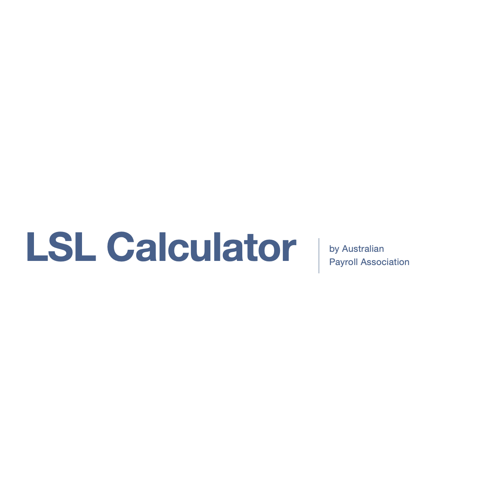
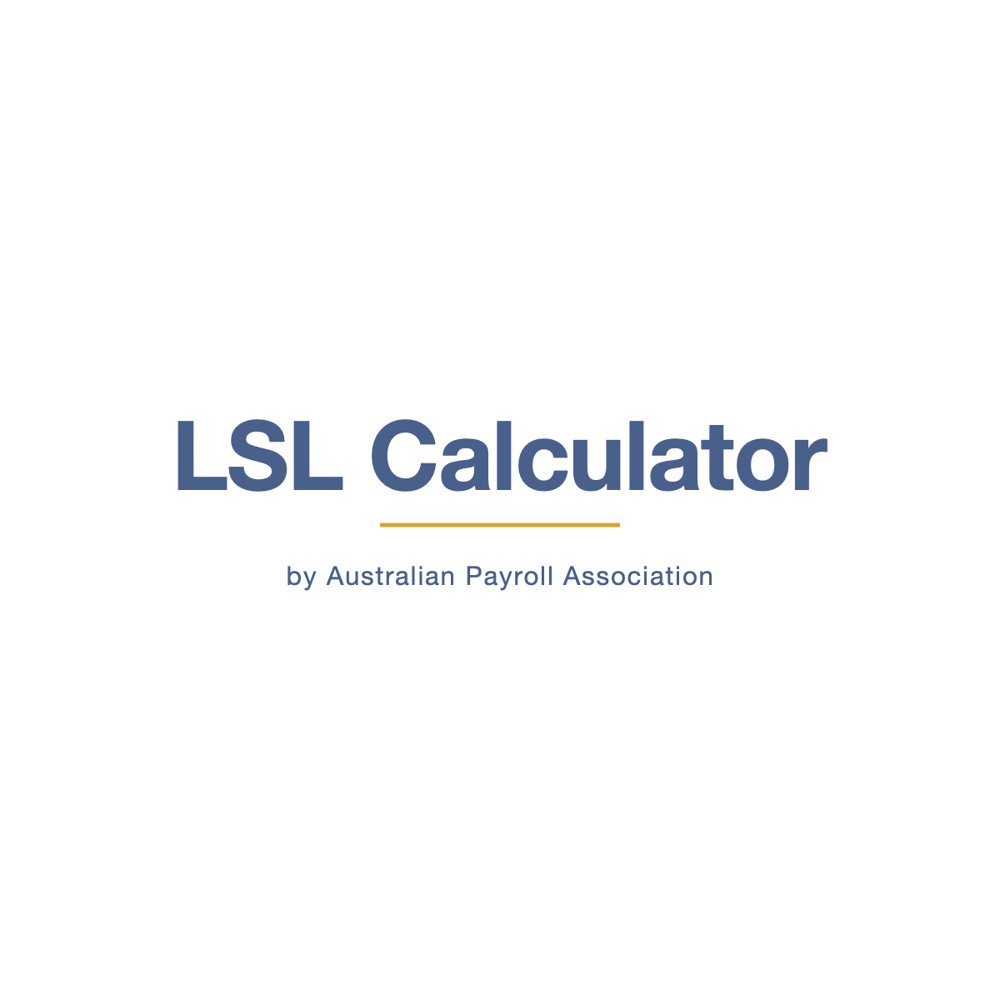
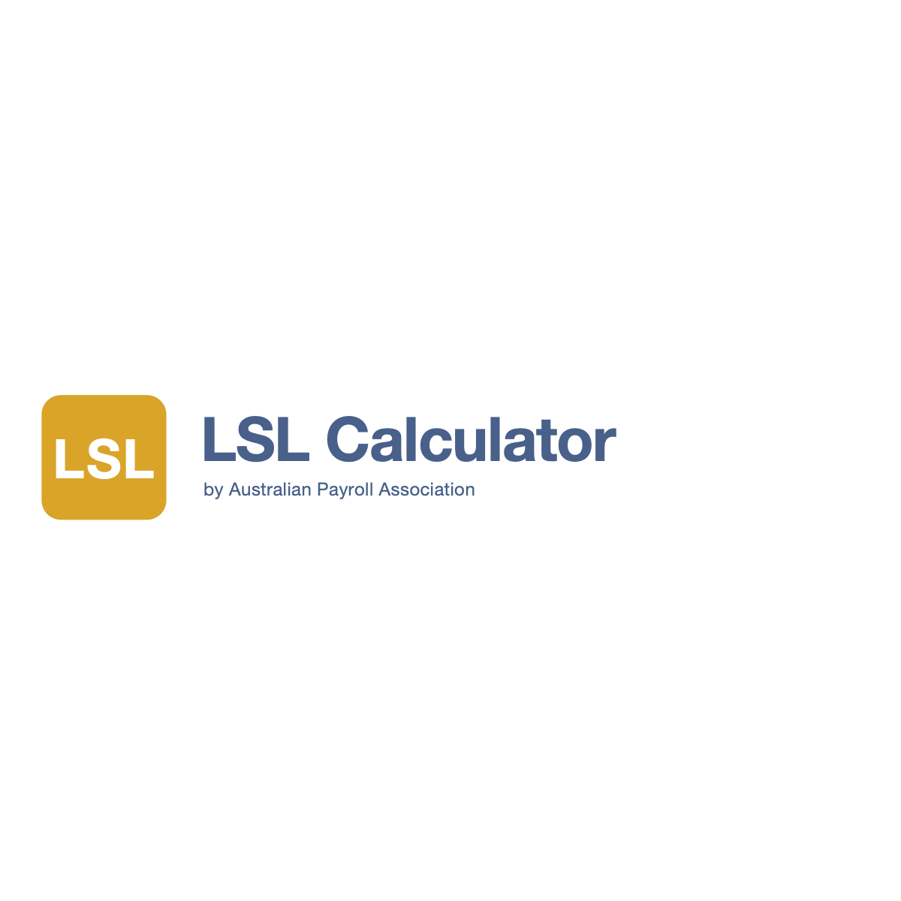

# LSL Calculator — Sub-Brand Wordmark Candidates (E6.1 / Task 1.2)

> ## ✅ DECISION: Candidate B — APPROVED
>
> **Approved by:** Tracy Angwin (operator)
> **Approved on:** 2026-05-28
> **Rationale:** Best fit for a product whose primary deliverable is formal PDF reports for CFOs and boards. The gold accent rule abstractly references the parent APA gold-square head per Brand Guidelines p.4 without literally copying the parent logomark — exactly the right "sibling, not copy" posture for OQ-1.
>
> **Downstream impact:**
> - Task 1.3 (icon direction) executes against Candidate B's hint: **navy icons with selective gold accents**, app icon = navy field with small gold mark (echoing parent's gold-square-on-blue composition from p.10).
> - Task 1.4 (final asset production) renders Candidate B's SVG as the master, with 1×/2×/3× PNGs, favicon set, monochrome variant, and white-on-navy variant.
> - Candidates A and C are kept in this folder for traceability but are NOT used downstream.

---

Three candidate wordmarks for **"LSL Calculator by Australian Payroll Association"** — produced 2026-05-28 by the designer agent for operator review.

All three honour the locked constraints from spec v0.4 (§5.1, §7.6, §8.1, §11 R-3) and the parent APA Brand Guidelines v2 (copied to `docs/brand/apa-brand-source.pdf`):

- **Primary mark** rendered in **Montserrat Semibold** at large size (88–96pt in the SVG viewBox — title-tier per APA p.18)
- **Secondary mark** rendered in **Source Sans Pro Regular** at body/H3 scale (22–26pt — H3/header tier per APA p.18)
- **Palette restricted** to APA primary navy `#48608a` (Pantone 2154 U), gold `#d9a428` (Pantone 110 U), pale grey-blue `#a0aec1` (Pantone 536 C) and white. No off-palette colours.
- **Sibling-product posture (OQ-1)**: distinct visual identity that reads as part of the APA family but is its own mark — not the APA wordmark with a suffix.

Files in this folder:

| File | Purpose |
| --- | --- |
| `candidate-a.svg` / `candidate-a.png` | Horizontal lockup with vertical divider rule (Xero precedent) |
| `candidate-b.svg` / `candidate-b.png` | Stacked masthead with gold accent rule |
| `candidate-c.svg` / `candidate-c.png` | Wordmark + gold "LSL" glyph (most distinctive) |
| `README.md` | This file |
| `../apa-brand-source.pdf` | Copy of APA Brand Guidelines v2 (24pp) — Task 1.1 deliverable |

---

## Candidate A — Horizontal "by APA" lockup

**Visual description.** "LSL Calculator" sits on a single line at the left in Montserrat Semibold navy. To its right, separated by a slim vertical grey-blue rule, the secondary line "by Australian / Payroll Association" stacks across two short lines in Source Sans Pro Regular at H3 scale.

**Why it works.** This is the most conservative of the three and directly mirrors the **APA Brand Guidelines page 10 "Brand Collaboration" rule** — a 1pt grey-blue divider line between the APA mark and a partner/secondary mark. By using that same divider treatment for the "by APA" tag we explicitly inherit the brand's documented co-mark grammar. It reads instantly as "an APA product" without dressing up. Closest sibling to the Xero Practice Manager precedent cited in OQ-1.

**Trade-off.** Lowest visual distinctiveness — without colour, this could pass as a generic SaaS title bar. Relies heavily on the parent APA logo appearing nearby (e.g. corner of every page, per p.7 "Primary Position: One of the four corners").

**Icon direction hint.** Suggests Task 1.3 should explore **monoline icons in navy** with the grey-blue divider rule motif carried through — restraint-first, very typographic. App icon would be a tight "LSL" or "LC" monogram in navy.

---

## Candidate B — Stacked wordmark with gold accent rule

**Visual description.** Centred vertical stack. "LSL Calculator" sits at the top in Montserrat Semibold navy. Below it, a short gold horizontal rule (~40% of the wordmark width, 4px). Below the rule, "by Australian Payroll Association" in Source Sans Pro Regular with generous letter-spacing.

**Why it works.** The gold rule is the design move. It explicitly references the **gold square "head" of the parent APA mark** (Brand Guidelines p.4: "Above them, the golden square symbolizes the head of the human figure, representing leadership, integrity, and the value of every individual.") without literally borrowing the parent logomark — exactly the right move for a sibling product. The stacked layout reads as a *masthead*, which fits a product that produces formal printable reports. Stronger sense of authority than Candidate A.

**Trade-off.** Wider than Candidate A in screen rows (taller vertical footprint), so it costs slightly more header real estate. The gold rule means the wordmark cannot sit cleanly on a gold background — needs navy or white.

**Icon direction hint.** Suggests Task 1.3 should explore **navy icons with selective gold accents** — e.g. a date-range icon where the "today" marker is gold, a "calculated" check that's gold, etc. App icon would be a navy field with a small gold mark (echoing the parent's gold-square-on-blue composition from p.10).

---

## Candidate C — Wordmark + gold "LSL" monogram glyph

**Visual description.** A rounded gold square on the left contains a white "LSL" monogram in Montserrat Bold. To its right, "LSL Calculator" sits on the upper line in Montserrat Semibold navy with "by Australian Payroll Association" tucked beneath in Source Sans Pro Regular navy.

**Why it works.** The gold rounded square is a direct echo of the **parent mark's golden square head** (p.4 — "value of individuals, leadership, and trust") and the **rounded corner radius** matches the APA app-icon treatment shown on **p.10**. We're not copying the parent logomark — we're inheriting its grammar. The glyph gives the sub-brand its own true visual identity, scales down beautifully to a 32×32 favicon, and produces the strongest "sibling product" lockup of the three. Closest to Xero's actual practice (Xero has its own X-mark distinct from any parent).

**Trade-off.** Most assertive of the three — if the operator wants the sub-brand to feel quietly subordinate to APA, this may read as too independent. Also introduces a permanent gold field which the brand guidelines tolerate (p.6 shows the parent on a full gold background) but is a strong colour commitment.

**Icon direction hint.** Suggests Task 1.3 should explore **gold-on-navy or navy-on-gold icon set** with rounded-square containers as a recurring motif. The "LSL" glyph itself becomes the app icon — favicon, OG image badge, loading spinner anchor, PDF cover badge. Strongest brand system continuity downstream.

---

## How to pick

Decision criteria, in priority order:

1. **Sibling posture (OQ-1).** All three honour it. Candidate C reads most distinctly as its own product; Candidate A reads most as "APA's calculator". Pick C if the operator wants the calculator to grow into its own product family; pick A if it should remain explicitly tethered to APA's primary identity.
2. **Downstream asset surface.** The calculator produces PDFs and reports (E6, Phase 3). A wordmark that survives reproduction as a small letterhead or footer mark wins. **Candidate C wins this** (the glyph survives even when type can't be read); **Candidate A wins on subtlety** at small sizes; **Candidate B is in the middle**.
3. **Tone match to the product.** This is a *long-service-leave calculator* — a serious, professional, payroll-compliance tool. All three are tonally aligned. Candidate B's masthead feel is the most "formal report cover"; Candidate A is the most "SaaS header"; Candidate C is the most "consumer app icon".
4. **Icon system continuity (Task 1.3 downstream).** Each candidate implies a different icon family — see the "Icon direction hint" notes above. Picking the wordmark commits you to that direction.

**Recommended default if undecided:** Candidate B. It's the strongest "report masthead" pick, the gold accent gives the sub-brand a unique visual hook that's traceable back to the parent without being literal, and it's the most forgiving across screen + print + PDF cover use.

---

## What's not in this run

Per the v0.4 spec and operator instruction, Task 1.2 stops at three SVG candidates + PNG previews + this README. The following are deferred to Task 1.3+ once the operator picks a candidate (or requests iteration):

- Icon set direction document (Task 1.3) — will branch off whichever candidate is approved
- Final asset production: PNG raster set @ 1×/2×/3×, favicon ICO + 16/32/180/192/512 PNGs, OG card, white-on-navy variant, monochrome variant (Task 1.4)
- Tokenisation into `website/` (Phase 2 / E6.2) — explicitly out of scope here

---

## Operator action required

1. Open this folder in Finder or VS Code and view the three PNG previews side by side.
2. Pick one candidate (A, B, or C) **or** request iteration on a specific candidate with concrete feedback (e.g. "B but in gold-on-navy", "C but with a different glyph treatment").
3. Once decided, dispatch the designer agent with the chosen candidate ID to execute **Task 1.3 (icon direction)** against the approved wordmark, then **Task 1.4 (final asset production)**.
4. Do not commit Phase 1 deliverables yet — leave them unstaged until the candidate is approved, so a rejected candidate can be deleted cleanly.
